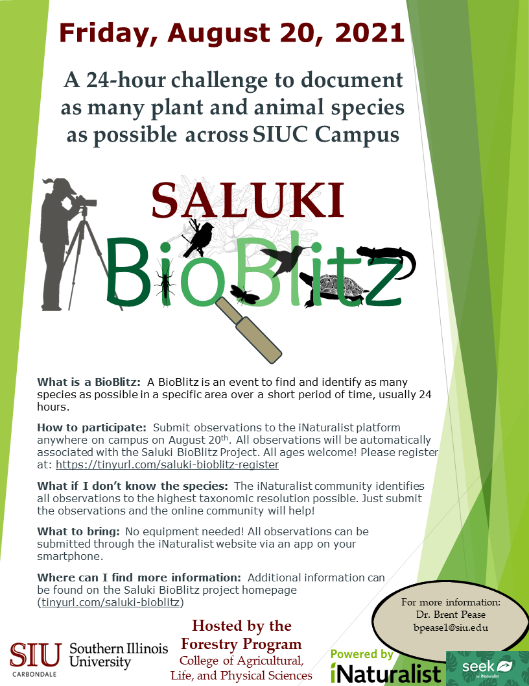

## Please join us for the first annual Saluki BioBlitz taking place on August 20th, 2021 across SIU-C Campus!     

The Saluki BioBlitz is an annual 24-hour challenge to document as many plant and animal species as possible across SIU's Carbondale campus. Starting on Friday, August 20th, 2021, participants can upload observations to [iNaturalist](https://www.inaturalist.org) and they will be automatically added to the [Saluki BioBlitz Project](https://www.inaturalist.org/projects/southern-illinois-university-saluki-bioblitz). There is no registration required - but consider adding your iNaturalist user ID on our form [here](https://tinyurl.com/saluki-bioblitz-register) - anyone can participate at anytime.     

Although you may see others out documenting biodiversity, this can be an individual activity and small groups are encouraged to adhere to current COVID-19 recommendations.    

The event is a great way to document and learn about the biodiversity across campus while contributing to the SIU Forestry Program's ongoing efforts of recording species occurrence across the region.

    

