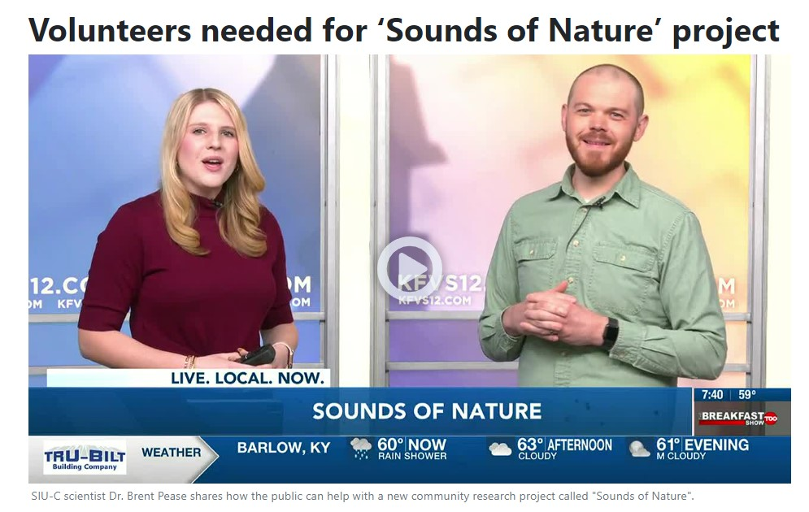

---
# An instance of the Blank widget.
# Documentation: https://wowchemy.com/docs/page-builder/
widget: blank

# This file represents a page section.
headless: true

# Should this widget show on page (t/f)
active: false

# Order that this section appears on the page.
weight: 5

# Section title
title: "News"

# Section subtitle
subtitle: "Media Coverage for Sounds of Nature"

# Section design
design:
  # Use a 1-column layout
  columns: "1"

---
  
  
Check out features on Sounds of Nature below!    

  
[KFVS-12 - Volunteers needed for 'Sounds of Nature' Project](https://www.kfvs12.com/2022/05/06/volunteers-needed-sounds-nature-project/)   

    

  
[SIU News - SIU Researcher Enlists citizen scientists to help track sounds of biodiversity](https://news.siu.edu/2022/04/042922-SIU-researcher-enlists-citizen-scientists-to-help-track-sounds-of-biodiversity.php)    
  
[The Southern Illinoisan - Tracking the sounds of Biodiversity](https://thesouthern.com/news/local/siu/siu-researcher-enlists-citizen-scientists-to-help-track-sounds-of-biodiversity/article_ebd164ba-d200-5f18-8c69-4b91be9c7034.html)    
  
----     
----     
----     
  
  [Top of the Page](https://peaselab.com/sounds)